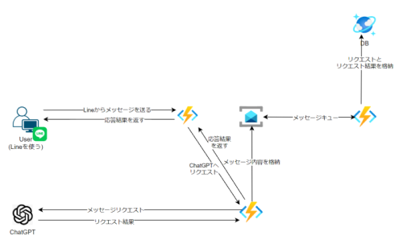

はじめに
----------------------------------------------

LineBotを作成するためのサンプルコードです。
ChatGPTにAPIをリクエストすることで、LINE Botが返答を返します。

システム構成図
----------------------------------------------

事前準備
----------------------------------------------
1. Line Developersにて、Messaging APIのチャンネルを作成する
2. ChatGPTのAPIを取得する

サーバの役割
----------------------------------------------
./backend
- キューメッセージに登録した内容を取得し、Cosmos DBに保存する
- 環境変数にて、Cosmos DBの接続情報を設定する

./func-to-gpt-api
- ChatGPTのAPIを呼び出す
- 環境変数にて、ChatGPTのAPIの接続情報を設定する
- 環境変数にて、ServiceBusの接続情報を設定する

./func-to-line-api
- Line Message APIを呼び出す
- Lineからメッセージを受信する
- 環境変数にて、Line Message APIの接続情報を設定する
- 環境変数にて、func-to-gpt-apiの接続情報を設定する
